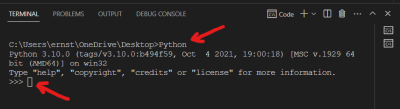

# Testing with Selenium

## Description of the project
This project uses the web directory of Northeastern State University to demonstrate how websites can be tested using Selenium. Selenium is a Python library that is great at identifying objects on webpages and using them for interactive input and output. 

## Installation
### Python
Go to the [Python download page](https://www.python.org/downloads/) and click on the button "Download the latest version for (your OS). Install as usual ( I personally prefer to install for all users, not for the current user). 
### Visual Studio Code
Go to [the Visual Studio Code home page](https://code.visualstudio.com/) and download the installation file. Install as usual (again, I prefer to install for all users). You can also use the [Visual Studio Code extension](https://code.visualstudio.com/docs/python/python-tutorial), but I personally have not tried it. Check if you can open Python in the terminal by typing Python at the prompt.

I also recommend installing the Code Runner extension, which allows you to run .py scripts more easily. 

### Selenium
From the command line, run "pip install selenium". If you are still at the Python command prompt, you can close it with the exit() command.

